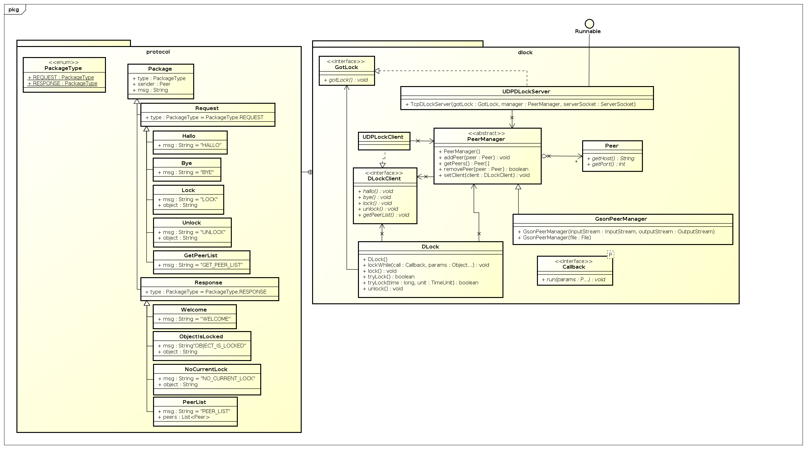

Builds will be available at:
http://aayvazyan.bitnamiapp.com/jenkins/

dLock is a peer to peer distributed lock manager.


#Installation:
Simply add the .jar as a library.

A Maven repo may be available soon. 

#Usage:
To get detailed information about the possibilities of dLock, take a look at the JavaDoc of the `DLock` class

##Simple Lock Example 1
example.java
```java
public class example {
    public void testObjectsPassed() throws InterruptedException {
        DLock lock = new DLock();
        lock.lock();
        foo();
        lock.unlock();
    }
}
```

##Lock Example 2
example.java
```java
public class example {
    public void testObjectsPassed() throws InterruptedException {
        Integer[] sumThis = new Integer[]{1, 1, 2};
        DLock lock = new DLock();
        //Here we wait until dLock is able to aquire a Lock and then keep the lock until Sum finished its run() call
        Integer result=(Integer) lock.lockWhile(new Sum(), sumThis);
    }
}
class Sum implements tgm.hit.rtn.dlock.Callback<Integer,Integer>{
    @Override
    public Integer run(Integer... params) {
        if(params==null)return 0;
        if(params.length==0)return 0;
        int sum=0;
        for (int i = 0; i < params.length; i++) {
            sum+=params[i].intValue();
        }
        return sum;
    }
}
```

#Contribution
Feel free to send pull requests and fork this repo.

##Design idea
Please note that this diagram does currently not represent the current state of this program.
